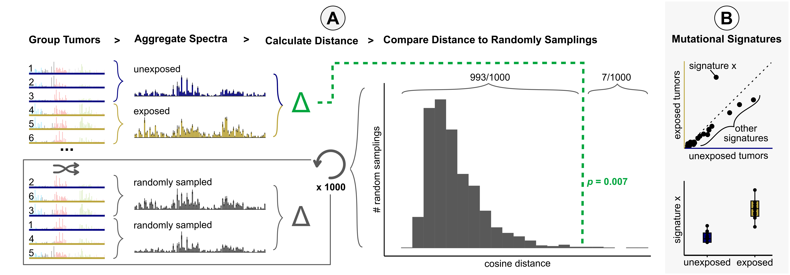
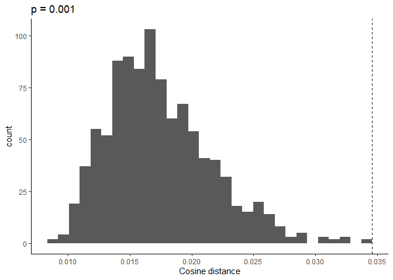
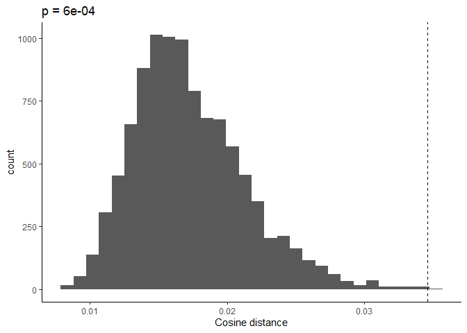
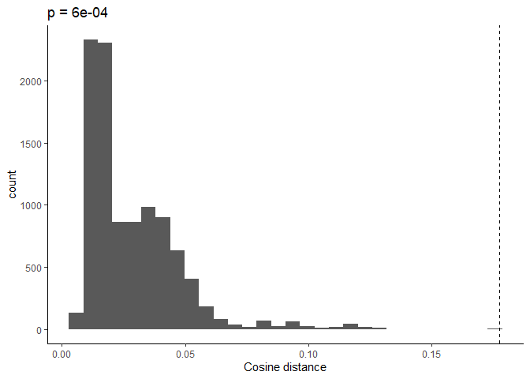
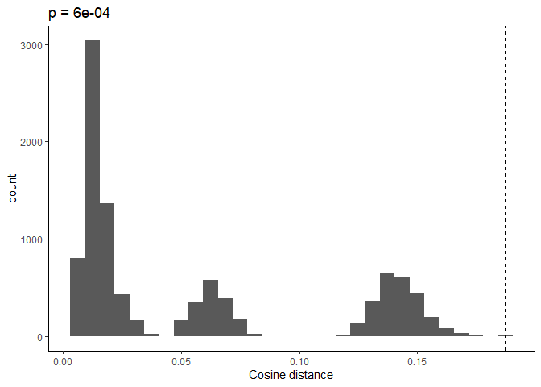

**mutspecdist**: package to run Aggregate Mutation Spectrum Distance
(AMSD)
================

<!-- badges: start -->

[](https://github.com/sfhart33/mutspecdist/actions/workflows/R-CMD-check.yaml)

<!-- badges: end -->

## Table of Contents

- [AMSD method summary](#amsd-method-summary)
- [Installation](#installation)
- [Main Functions](#main-functions)
- [Usage Example](#usage-example)
- [Citation](#citation)

## AMSD method summary



- Input mutation spectra for each sample in a cohort divided into two
  groups. As an example here we have a group of tumors unexposed (blue)
  or exposed (gold) to carcinogen.
- AMSD aggregates mutation spectra for each group and calculates the
  cosine distance between the aggregate spectra (green).
- AMSD also randomly reshuffles group labels to calculate the cosine
  distance between randomly sampled tumors (grey), repeating 1000+ times
  to create a null distribution expectation.
- AMSD then calculates a p-value from the fraction of random samplings
  that are greater than or equal to the observed distance between the
  two groups, as visualized in the histogram.
- To interpret what mutational mechanisms may be behind a significant
  difference, we recommend applying mutational signature fitting to the
  aggregate spectra and/or individual samples and comparing between the
  two groups.

## Installation

``` r
# install.packages("devtools")
devtools::install_github("sfhart33/mutspecdist")
library(mutspecdist)
```

## Main Functions

- `amsd()` – run the core AMSD test and return cosine distance, null
  distribution, and p-value
- `plot_amsd_histogram()` – plot the null distribution with observed
  distance
- `simulate_spectra()` – simulate spectra using trinucleotide signatures
- `cosine_dist()` – calculate the cosine distance between two vectors

## Usage Example

Load example data (data is from “[The mutational signature profile of
known and suspected human carcinogens in
mice](https://www.nature.com/articles/s41588-020-0692-4)” by Riva et
al. Raw data is available
[here](https://github.com/team113sanger/mouse-mutatation-signatures/blob/master/starting_data/snvs.rds))

``` r
data(mouse_sample_table)
data(mouse_carcinogen_counts)
mouse_carcinogen_spectra <- mouse_carcinogen_counts/rowSums(mouse_carcinogen_counts)
```

Example comparison: Oxazepam-exposed vs control mouse tumors

``` r
# function to output spectra
group_spectra <- function(spectra, exp, tis){
  exposure <- mouse_sample_table$exposure == exp &
    mouse_sample_table$tissue == tis
  exp_samples <-  mouse_sample_table$label[exposure]
  exp_spectra <- spectra[exp_samples,]
  return(exp_spectra)
}

# mutation spectra for tumors exposed to Oxazepam
  ox_spectra <- group_spectra(mouse_carcinogen_spectra, "OXAZEPAM", "LIVER")
  knitr::kable(ox_spectra)
```

|  | ACA\>AAA | ACC\>AAC | ACG\>AAG | ACT\>AAT | CCA\>CAA | CCC\>CAC | CCG\>CAG | CCT\>CAT | GCA\>GAA | GCC\>GAC | GCG\>GAG | GCT\>GAT | TCA\>TAA | TCC\>TAC | TCG\>TAG | TCT\>TAT | ACA\>AGA | ACC\>AGC | ACG\>AGG | ACT\>AGT | CCA\>CGA | CCC\>CGC | CCG\>CGG | CCT\>CGT | GCA\>GGA | GCC\>GGC | GCG\>GGG | GCT\>GGT | TCA\>TGA | TCC\>TGC | TCG\>TGG | TCT\>TGT | ACA\>ATA | ACC\>ATC | ACG\>ATG | ACT\>ATT | CCA\>CTA | CCC\>CTC | CCG\>CTG | CCT\>CTT | GCA\>GTA | GCC\>GTC | GCG\>GTG | GCT\>GTT | TCA\>TTA | TCC\>TTC | TCG\>TTG | TCT\>TTT | ATA\>AAA | ATC\>AAC | ATG\>AAG | ATT\>AAT | CTA\>CAA | CTC\>CAC | CTG\>CAG | CTT\>CAT | GTA\>GAA | GTC\>GAC | GTG\>GAG | GTT\>GAT | TTA\>TAA | TTC\>TAC | TTG\>TAG | TTT\>TAT | ATA\>ACA | ATC\>ACC | ATG\>ACG | ATT\>ACT | CTA\>CCA | CTC\>CCC | CTG\>CCG | CTT\>CCT | GTA\>GCA | GTC\>GCC | GTG\>GCG | GTT\>GCT | TTA\>TCA | TTC\>TCC | TTG\>TCG | TTT\>TCT | ATA\>AGA | ATC\>AGC | ATG\>AGG | ATT\>AGT | CTA\>CGA | CTC\>CGC | CTG\>CGG | CTT\>CGT | GTA\>GGA | GTC\>GGC | GTG\>GGG | GTT\>GGT | TTA\>TGA | TTC\>TGC | TTG\>TGG | TTT\>TGT |
|:---|---:|---:|---:|---:|---:|---:|---:|---:|---:|---:|---:|---:|---:|---:|---:|---:|---:|---:|---:|---:|---:|---:|---:|---:|---:|---:|---:|---:|---:|---:|---:|---:|---:|---:|---:|---:|---:|---:|---:|---:|---:|---:|---:|---:|---:|---:|---:|---:|---:|---:|---:|---:|---:|---:|---:|---:|---:|---:|---:|---:|---:|---:|---:|---:|---:|---:|---:|---:|---:|---:|---:|---:|---:|---:|---:|---:|---:|---:|---:|---:|---:|---:|---:|---:|---:|---:|---:|---:|---:|---:|---:|---:|---:|---:|---:|---:|
| LIVER_OXAZEPAM_1 | 0.0320641 | 0.0100200 | 0.0040080 | 0.0220441 | 0.0280561 | 0.0100200 | 0.0020040 | 0.0240481 | 0.0220441 | 0.0080160 | 0.0000000 | 0.0160321 | 0.0240481 | 0.0240481 | 0.0020040 | 0.0300601 | 0.0060120 | 0.0020040 | 0.0060120 | 0.0100200 | 0.0020040 | 0.0060120 | 0.0020040 | 0.0000000 | 0.0020040 | 0.0060120 | 0.0020040 | 0.0020040 | 0.0080160 | 0.0080160 | 0.0020040 | 0.0040080 | 0.0160321 | 0.0180361 | 0.0220441 | 0.0180361 | 0.0140281 | 0.0240481 | 0.0220441 | 0.0100200 | 0.0180361 | 0.0140281 | 0.0320641 | 0.0120240 | 0.0120240 | 0.0220441 | 0.0120240 | 0.0240481 | 0.0080160 | 0.0040080 | 0.0120240 | 0.0100200 | 0.0100200 | 0.0060120 | 0.0140281 | 0.0080160 | 0.0020040 | 0.0020040 | 0.0100200 | 0.0060120 | 0.0260521 | 0.0100200 | 0.0060120 | 0.0120240 | 0.0080160 | 0.0080160 | 0.0240481 | 0.0180361 | 0.0020040 | 0.0040080 | 0.0060120 | 0.0020040 | 0.0140281 | 0.0100200 | 0.0040080 | 0.0100200 | 0.0060120 | 0.0120240 | 0.0080160 | 0.0080160 | 0.0060120 | 0.0040080 | 0.0060120 | 0.0100200 | 0.0000000 | 0.0100200 | 0.0000000 | 0.0260521 | 0.0000000 | 0.0020040 | 0.0020040 | 0.0120240 | 0.0020040 | 0.0000000 | 0.0000000 | 0.0120240 |
| LIVER_OXAZEPAM_2 | 0.0340807 | 0.0197309 | 0.0017937 | 0.0134529 | 0.0197309 | 0.0089686 | 0.0000000 | 0.0125561 | 0.0116592 | 0.0071749 | 0.0017937 | 0.0107623 | 0.0197309 | 0.0161435 | 0.0026906 | 0.0358744 | 0.0062780 | 0.0026906 | 0.0026906 | 0.0080717 | 0.0017937 | 0.0017937 | 0.0008969 | 0.0008969 | 0.0008969 | 0.0134529 | 0.0000000 | 0.0026906 | 0.0026906 | 0.0026906 | 0.0008969 | 0.0035874 | 0.0197309 | 0.0116592 | 0.0304933 | 0.0161435 | 0.0098655 | 0.0098655 | 0.0161435 | 0.0107623 | 0.0134529 | 0.0089686 | 0.0188341 | 0.0134529 | 0.0251121 | 0.0143498 | 0.0098655 | 0.0233184 | 0.0098655 | 0.0035874 | 0.0080717 | 0.0098655 | 0.0071749 | 0.0125561 | 0.0134529 | 0.0206278 | 0.0035874 | 0.0053812 | 0.0053812 | 0.0125561 | 0.0125561 | 0.0062780 | 0.0044843 | 0.0197309 | 0.0089686 | 0.0080717 | 0.0107623 | 0.0098655 | 0.0098655 | 0.0161435 | 0.0098655 | 0.0286996 | 0.0053812 | 0.0080717 | 0.0071749 | 0.0071749 | 0.0098655 | 0.0053812 | 0.0071749 | 0.0170404 | 0.0008969 | 0.0035874 | 0.0062780 | 0.0197309 | 0.0000000 | 0.0053812 | 0.0026906 | 0.0690583 | 0.0000000 | 0.0017937 | 0.0035874 | 0.0188341 | 0.0017937 | 0.0017937 | 0.0008969 | 0.0188341 |
| LIVER_OXAZEPAM_3 | 0.0257802 | 0.0135685 | 0.0013569 | 0.0217096 | 0.0312076 | 0.0135685 | 0.0094980 | 0.0149254 | 0.0162822 | 0.0176391 | 0.0027137 | 0.0108548 | 0.0217096 | 0.0162822 | 0.0027137 | 0.0339213 | 0.0162822 | 0.0013569 | 0.0027137 | 0.0040706 | 0.0081411 | 0.0027137 | 0.0013569 | 0.0040706 | 0.0054274 | 0.0149254 | 0.0000000 | 0.0013569 | 0.0040706 | 0.0027137 | 0.0013569 | 0.0149254 | 0.0257802 | 0.0203528 | 0.0149254 | 0.0149254 | 0.0189959 | 0.0149254 | 0.0135685 | 0.0122117 | 0.0162822 | 0.0108548 | 0.0230665 | 0.0176391 | 0.0230665 | 0.0298507 | 0.0135685 | 0.0230665 | 0.0122117 | 0.0067843 | 0.0081411 | 0.0135685 | 0.0067843 | 0.0054274 | 0.0067843 | 0.0176391 | 0.0054274 | 0.0067843 | 0.0040706 | 0.0094980 | 0.0094980 | 0.0027137 | 0.0067843 | 0.0149254 | 0.0189959 | 0.0135685 | 0.0149254 | 0.0162822 | 0.0067843 | 0.0054274 | 0.0054274 | 0.0176391 | 0.0027137 | 0.0054274 | 0.0067843 | 0.0122117 | 0.0094980 | 0.0094980 | 0.0054274 | 0.0081411 | 0.0054274 | 0.0013569 | 0.0027137 | 0.0081411 | 0.0040706 | 0.0000000 | 0.0040706 | 0.0135685 | 0.0013569 | 0.0027137 | 0.0027137 | 0.0122117 | 0.0000000 | 0.0000000 | 0.0027137 | 0.0108548 |
| LIVER_OXAZEPAM_4 | 0.0456853 | 0.0135364 | 0.0033841 | 0.0169205 | 0.0304569 | 0.0203046 | 0.0000000 | 0.0169205 | 0.0253807 | 0.0084602 | 0.0000000 | 0.0287648 | 0.0287648 | 0.0270728 | 0.0016920 | 0.0219966 | 0.0084602 | 0.0033841 | 0.0050761 | 0.0101523 | 0.0016920 | 0.0016920 | 0.0033841 | 0.0067682 | 0.0000000 | 0.0067682 | 0.0033841 | 0.0118443 | 0.0067682 | 0.0033841 | 0.0016920 | 0.0067682 | 0.0253807 | 0.0084602 | 0.0236887 | 0.0101523 | 0.0236887 | 0.0135364 | 0.0270728 | 0.0186125 | 0.0169205 | 0.0169205 | 0.0135364 | 0.0186125 | 0.0152284 | 0.0287648 | 0.0118443 | 0.0287648 | 0.0135364 | 0.0033841 | 0.0101523 | 0.0186125 | 0.0101523 | 0.0169205 | 0.0118443 | 0.0067682 | 0.0033841 | 0.0067682 | 0.0016920 | 0.0016920 | 0.0219966 | 0.0050761 | 0.0050761 | 0.0118443 | 0.0067682 | 0.0101523 | 0.0169205 | 0.0152284 | 0.0067682 | 0.0033841 | 0.0033841 | 0.0118443 | 0.0067682 | 0.0050761 | 0.0067682 | 0.0118443 | 0.0067682 | 0.0033841 | 0.0000000 | 0.0084602 | 0.0016920 | 0.0016920 | 0.0084602 | 0.0050761 | 0.0000000 | 0.0033841 | 0.0000000 | 0.0101523 | 0.0000000 | 0.0016920 | 0.0016920 | 0.0050761 | 0.0016920 | 0.0033841 | 0.0016920 | 0.0101523 |
| LIVER_OXAZEPAM_5 | 0.0528497 | 0.0176166 | 0.0020725 | 0.0176166 | 0.0279793 | 0.0103627 | 0.0031088 | 0.0176166 | 0.0176166 | 0.0082902 | 0.0031088 | 0.0217617 | 0.0196891 | 0.0124352 | 0.0031088 | 0.0445596 | 0.0082902 | 0.0072539 | 0.0010363 | 0.0041451 | 0.0010363 | 0.0020725 | 0.0020725 | 0.0031088 | 0.0000000 | 0.0062176 | 0.0020725 | 0.0031088 | 0.0041451 | 0.0041451 | 0.0000000 | 0.0082902 | 0.0279793 | 0.0103627 | 0.0300518 | 0.0145078 | 0.0196891 | 0.0207254 | 0.0176166 | 0.0269430 | 0.0176166 | 0.0227979 | 0.0134715 | 0.0186528 | 0.0321244 | 0.0207254 | 0.0113990 | 0.0393782 | 0.0082902 | 0.0062176 | 0.0072539 | 0.0082902 | 0.0051813 | 0.0082902 | 0.0072539 | 0.0124352 | 0.0020725 | 0.0020725 | 0.0062176 | 0.0051813 | 0.0124352 | 0.0041451 | 0.0082902 | 0.0103627 | 0.0145078 | 0.0103627 | 0.0103627 | 0.0165803 | 0.0103627 | 0.0072539 | 0.0051813 | 0.0186528 | 0.0062176 | 0.0041451 | 0.0051813 | 0.0062176 | 0.0124352 | 0.0031088 | 0.0051813 | 0.0072539 | 0.0041451 | 0.0072539 | 0.0020725 | 0.0072539 | 0.0020725 | 0.0010363 | 0.0031088 | 0.0082902 | 0.0010363 | 0.0000000 | 0.0031088 | 0.0062176 | 0.0031088 | 0.0020725 | 0.0041451 | 0.0072539 |

``` r
# mutation spectra for spontaneously arising tumors
  control_spectra <- group_spectra(mouse_carcinogen_spectra, "SPONTANEOUS", "LIVER")
  knitr::kable(control_spectra)
```

|  | ACA\>AAA | ACC\>AAC | ACG\>AAG | ACT\>AAT | CCA\>CAA | CCC\>CAC | CCG\>CAG | CCT\>CAT | GCA\>GAA | GCC\>GAC | GCG\>GAG | GCT\>GAT | TCA\>TAA | TCC\>TAC | TCG\>TAG | TCT\>TAT | ACA\>AGA | ACC\>AGC | ACG\>AGG | ACT\>AGT | CCA\>CGA | CCC\>CGC | CCG\>CGG | CCT\>CGT | GCA\>GGA | GCC\>GGC | GCG\>GGG | GCT\>GGT | TCA\>TGA | TCC\>TGC | TCG\>TGG | TCT\>TGT | ACA\>ATA | ACC\>ATC | ACG\>ATG | ACT\>ATT | CCA\>CTA | CCC\>CTC | CCG\>CTG | CCT\>CTT | GCA\>GTA | GCC\>GTC | GCG\>GTG | GCT\>GTT | TCA\>TTA | TCC\>TTC | TCG\>TTG | TCT\>TTT | ATA\>AAA | ATC\>AAC | ATG\>AAG | ATT\>AAT | CTA\>CAA | CTC\>CAC | CTG\>CAG | CTT\>CAT | GTA\>GAA | GTC\>GAC | GTG\>GAG | GTT\>GAT | TTA\>TAA | TTC\>TAC | TTG\>TAG | TTT\>TAT | ATA\>ACA | ATC\>ACC | ATG\>ACG | ATT\>ACT | CTA\>CCA | CTC\>CCC | CTG\>CCG | CTT\>CCT | GTA\>GCA | GTC\>GCC | GTG\>GCG | GTT\>GCT | TTA\>TCA | TTC\>TCC | TTG\>TCG | TTT\>TCT | ATA\>AGA | ATC\>AGC | ATG\>AGG | ATT\>AGT | CTA\>CGA | CTC\>CGC | CTG\>CGG | CTT\>CGT | GTA\>GGA | GTC\>GGC | GTG\>GGG | GTT\>GGT | TTA\>TGA | TTC\>TGC | TTG\>TGG | TTT\>TGT |
|:---|---:|---:|---:|---:|---:|---:|---:|---:|---:|---:|---:|---:|---:|---:|---:|---:|---:|---:|---:|---:|---:|---:|---:|---:|---:|---:|---:|---:|---:|---:|---:|---:|---:|---:|---:|---:|---:|---:|---:|---:|---:|---:|---:|---:|---:|---:|---:|---:|---:|---:|---:|---:|---:|---:|---:|---:|---:|---:|---:|---:|---:|---:|---:|---:|---:|---:|---:|---:|---:|---:|---:|---:|---:|---:|---:|---:|---:|---:|---:|---:|---:|---:|---:|---:|---:|---:|---:|---:|---:|---:|---:|---:|---:|---:|---:|---:|
| LIVER_SPONTANEOUS_1 | 0.0304000 | 0.0176000 | 0.0016000 | 0.0200000 | 0.0248000 | 0.0168000 | 0.0024000 | 0.0112000 | 0.0152000 | 0.0080000 | 0.0024000 | 0.0120000 | 0.0272000 | 0.0168000 | 0.0016000 | 0.0328000 | 0.0112000 | 0.0040000 | 0.0016000 | 0.0104000 | 0.0056000 | 0.0008000 | 0.0040000 | 0.0064000 | 0.0024000 | 0.0072000 | 0.0008000 | 0.0024000 | 0.0056000 | 0.0064000 | 0.0008000 | 0.0072000 | 0.0264000 | 0.0144000 | 0.0264000 | 0.0264000 | 0.0256000 | 0.0176000 | 0.0144000 | 0.0176000 | 0.0200000 | 0.0144000 | 0.0256000 | 0.0144000 | 0.0264000 | 0.0256000 | 0.0160000 | 0.0248000 | 0.0104000 | 0.0056000 | 0.0064000 | 0.0144000 | 0.0032000 | 0.0064000 | 0.0080000 | 0.0128000 | 0.0016000 | 0.0056000 | 0.0048000 | 0.0040000 | 0.0112000 | 0.0024000 | 0.0064000 | 0.0072000 | 0.0200000 | 0.0056000 | 0.0152000 | 0.0120000 | 0.0064000 | 0.0016000 | 0.0040000 | 0.0120000 | 0.0112000 | 0.0080000 | 0.0080000 | 0.0088000 | 0.0120000 | 0.0088000 | 0.0056000 | 0.0136000 | 0.0056000 | 0.0016000 | 0.0040000 | 0.0072000 | 0.0024000 | 0.0048000 | 0.0040000 | 0.0152000 | 0.0000000 | 0.0040000 | 0.0064000 | 0.0040000 | 0.0048000 | 0.0016000 | 0.0032000 | 0.0144000 |
| LIVER_SPONTANEOUS_10 | 0.0458265 | 0.0229133 | 0.0032733 | 0.0245499 | 0.0196399 | 0.0147300 | 0.0081833 | 0.0114566 | 0.0114566 | 0.0163666 | 0.0049100 | 0.0130933 | 0.0196399 | 0.0245499 | 0.0000000 | 0.0261866 | 0.0098200 | 0.0065466 | 0.0016367 | 0.0098200 | 0.0049100 | 0.0032733 | 0.0032733 | 0.0032733 | 0.0016367 | 0.0065466 | 0.0016367 | 0.0032733 | 0.0032733 | 0.0032733 | 0.0032733 | 0.0049100 | 0.0360065 | 0.0065466 | 0.0441899 | 0.0212766 | 0.0180033 | 0.0212766 | 0.0180033 | 0.0130933 | 0.0163666 | 0.0130933 | 0.0180033 | 0.0114566 | 0.0196399 | 0.0261866 | 0.0310966 | 0.0196399 | 0.0196399 | 0.0032733 | 0.0081833 | 0.0196399 | 0.0147300 | 0.0065466 | 0.0081833 | 0.0098200 | 0.0081833 | 0.0016367 | 0.0081833 | 0.0065466 | 0.0049100 | 0.0065466 | 0.0049100 | 0.0114566 | 0.0245499 | 0.0049100 | 0.0196399 | 0.0196399 | 0.0032733 | 0.0032733 | 0.0000000 | 0.0114566 | 0.0065466 | 0.0000000 | 0.0016367 | 0.0065466 | 0.0147300 | 0.0065466 | 0.0016367 | 0.0049100 | 0.0000000 | 0.0016367 | 0.0032733 | 0.0049100 | 0.0000000 | 0.0016367 | 0.0081833 | 0.0065466 | 0.0016367 | 0.0000000 | 0.0032733 | 0.0049100 | 0.0016367 | 0.0016367 | 0.0098200 | 0.0081833 |
| LIVER_SPONTANEOUS_11 | 0.0364540 | 0.0115990 | 0.0008285 | 0.0173985 | 0.0248550 | 0.0124275 | 0.0008285 | 0.0115990 | 0.0140845 | 0.0024855 | 0.0033140 | 0.0115990 | 0.0207125 | 0.0157415 | 0.0008285 | 0.0273405 | 0.0082850 | 0.0024855 | 0.0000000 | 0.0082850 | 0.0016570 | 0.0033140 | 0.0074565 | 0.0033140 | 0.0033140 | 0.0033140 | 0.0000000 | 0.0033140 | 0.0057995 | 0.0049710 | 0.0000000 | 0.0099420 | 0.0248550 | 0.0190555 | 0.0215410 | 0.0289975 | 0.0173985 | 0.0149130 | 0.0091135 | 0.0215410 | 0.0207125 | 0.0165700 | 0.0182270 | 0.0149130 | 0.0273405 | 0.0231980 | 0.0173985 | 0.0265120 | 0.0099420 | 0.0066280 | 0.0099420 | 0.0173985 | 0.0091135 | 0.0082850 | 0.0091135 | 0.0140845 | 0.0074565 | 0.0024855 | 0.0082850 | 0.0074565 | 0.0124275 | 0.0066280 | 0.0057995 | 0.0115990 | 0.0223695 | 0.0165700 | 0.0273405 | 0.0281690 | 0.0091135 | 0.0041425 | 0.0049710 | 0.0066280 | 0.0124275 | 0.0074565 | 0.0074565 | 0.0074565 | 0.0124275 | 0.0091135 | 0.0082850 | 0.0149130 | 0.0033140 | 0.0000000 | 0.0033140 | 0.0057995 | 0.0033140 | 0.0041425 | 0.0033140 | 0.0082850 | 0.0008285 | 0.0000000 | 0.0033140 | 0.0024855 | 0.0016570 | 0.0041425 | 0.0016570 | 0.0091135 |
| LIVER_SPONTANEOUS_2 | 0.0335484 | 0.0206452 | 0.0038710 | 0.0335484 | 0.0129032 | 0.0141935 | 0.0000000 | 0.0219355 | 0.0025806 | 0.0025806 | 0.0012903 | 0.0141935 | 0.0232258 | 0.0193548 | 0.0000000 | 0.0309677 | 0.0077419 | 0.0077419 | 0.0051613 | 0.0116129 | 0.0064516 | 0.0090323 | 0.0000000 | 0.0051613 | 0.0038710 | 0.0064516 | 0.0000000 | 0.0064516 | 0.0051613 | 0.0038710 | 0.0000000 | 0.0103226 | 0.0141935 | 0.0167742 | 0.0219355 | 0.0296774 | 0.0141935 | 0.0141935 | 0.0077419 | 0.0309677 | 0.0116129 | 0.0129032 | 0.0064516 | 0.0090323 | 0.0232258 | 0.0193548 | 0.0090323 | 0.0232258 | 0.0129032 | 0.0090323 | 0.0077419 | 0.0103226 | 0.0090323 | 0.0077419 | 0.0090323 | 0.0154839 | 0.0025806 | 0.0025806 | 0.0025806 | 0.0064516 | 0.0090323 | 0.0012903 | 0.0064516 | 0.0064516 | 0.0296774 | 0.0129032 | 0.0245161 | 0.0309677 | 0.0051613 | 0.0025806 | 0.0064516 | 0.0141935 | 0.0103226 | 0.0077419 | 0.0154839 | 0.0103226 | 0.0232258 | 0.0038710 | 0.0116129 | 0.0103226 | 0.0103226 | 0.0000000 | 0.0025806 | 0.0090323 | 0.0012903 | 0.0012903 | 0.0038710 | 0.0103226 | 0.0012903 | 0.0000000 | 0.0012903 | 0.0064516 | 0.0090323 | 0.0038710 | 0.0025806 | 0.0103226 |
| LIVER_SPONTANEOUS_3 | 0.0383189 | 0.0222497 | 0.0024722 | 0.0185414 | 0.0197775 | 0.0111248 | 0.0024722 | 0.0173053 | 0.0135970 | 0.0024722 | 0.0000000 | 0.0160692 | 0.0271941 | 0.0160692 | 0.0061805 | 0.0321384 | 0.0074166 | 0.0061805 | 0.0012361 | 0.0135970 | 0.0049444 | 0.0037083 | 0.0061805 | 0.0098888 | 0.0024722 | 0.0086527 | 0.0012361 | 0.0037083 | 0.0037083 | 0.0037083 | 0.0012361 | 0.0086527 | 0.0346106 | 0.0197775 | 0.0222497 | 0.0247219 | 0.0160692 | 0.0185414 | 0.0111248 | 0.0185414 | 0.0160692 | 0.0135970 | 0.0185414 | 0.0185414 | 0.0210136 | 0.0309023 | 0.0173053 | 0.0222497 | 0.0123609 | 0.0012361 | 0.0061805 | 0.0210136 | 0.0086527 | 0.0086527 | 0.0098888 | 0.0111248 | 0.0061805 | 0.0049444 | 0.0024722 | 0.0049444 | 0.0210136 | 0.0086527 | 0.0074166 | 0.0173053 | 0.0123609 | 0.0049444 | 0.0222497 | 0.0061805 | 0.0086527 | 0.0049444 | 0.0061805 | 0.0061805 | 0.0111248 | 0.0024722 | 0.0086527 | 0.0135970 | 0.0061805 | 0.0049444 | 0.0061805 | 0.0024722 | 0.0049444 | 0.0024722 | 0.0037083 | 0.0012361 | 0.0037083 | 0.0049444 | 0.0037083 | 0.0098888 | 0.0012361 | 0.0024722 | 0.0024722 | 0.0049444 | 0.0037083 | 0.0024722 | 0.0000000 | 0.0123609 |
| LIVER_SPONTANEOUS_4 | 0.0476190 | 0.0164502 | 0.0034632 | 0.0216450 | 0.0251082 | 0.0190476 | 0.0008658 | 0.0190476 | 0.0181818 | 0.0051948 | 0.0025974 | 0.0095238 | 0.0147186 | 0.0225108 | 0.0017316 | 0.0389610 | 0.0069264 | 0.0051948 | 0.0008658 | 0.0077922 | 0.0069264 | 0.0034632 | 0.0017316 | 0.0060606 | 0.0034632 | 0.0043290 | 0.0017316 | 0.0051948 | 0.0077922 | 0.0017316 | 0.0000000 | 0.0060606 | 0.0294372 | 0.0103896 | 0.0303030 | 0.0173160 | 0.0199134 | 0.0121212 | 0.0199134 | 0.0259740 | 0.0225108 | 0.0103896 | 0.0164502 | 0.0173160 | 0.0277056 | 0.0285714 | 0.0112554 | 0.0259740 | 0.0121212 | 0.0060606 | 0.0164502 | 0.0077922 | 0.0069264 | 0.0069264 | 0.0095238 | 0.0086580 | 0.0034632 | 0.0043290 | 0.0034632 | 0.0034632 | 0.0112554 | 0.0086580 | 0.0034632 | 0.0112554 | 0.0199134 | 0.0147186 | 0.0233766 | 0.0181818 | 0.0000000 | 0.0112554 | 0.0077922 | 0.0112554 | 0.0095238 | 0.0060606 | 0.0043290 | 0.0069264 | 0.0112554 | 0.0060606 | 0.0069264 | 0.0060606 | 0.0034632 | 0.0017316 | 0.0017316 | 0.0069264 | 0.0008658 | 0.0017316 | 0.0008658 | 0.0069264 | 0.0034632 | 0.0000000 | 0.0008658 | 0.0043290 | 0.0008658 | 0.0034632 | 0.0043290 | 0.0095238 |
| LIVER_SPONTANEOUS_5 | 0.0220930 | 0.0069767 | 0.0034884 | 0.0209302 | 0.0174419 | 0.0081395 | 0.0011628 | 0.0127907 | 0.0151163 | 0.0093023 | 0.0023256 | 0.0058140 | 0.0186047 | 0.0197674 | 0.0011628 | 0.0232558 | 0.0104651 | 0.0093023 | 0.0023256 | 0.0151163 | 0.0034884 | 0.0046512 | 0.0000000 | 0.0046512 | 0.0034884 | 0.0174419 | 0.0000000 | 0.0116279 | 0.0058140 | 0.0046512 | 0.0011628 | 0.0104651 | 0.0267442 | 0.0127907 | 0.0313953 | 0.0290698 | 0.0116279 | 0.0093023 | 0.0127907 | 0.0255814 | 0.0139535 | 0.0151163 | 0.0290698 | 0.0209302 | 0.0279070 | 0.0174419 | 0.0162791 | 0.0372093 | 0.0197674 | 0.0069767 | 0.0093023 | 0.0279070 | 0.0058140 | 0.0093023 | 0.0046512 | 0.0081395 | 0.0046512 | 0.0046512 | 0.0011628 | 0.0104651 | 0.0220930 | 0.0034884 | 0.0093023 | 0.0162791 | 0.0151163 | 0.0046512 | 0.0139535 | 0.0093023 | 0.0081395 | 0.0046512 | 0.0034884 | 0.0069767 | 0.0046512 | 0.0093023 | 0.0139535 | 0.0046512 | 0.0139535 | 0.0058140 | 0.0058140 | 0.0069767 | 0.0104651 | 0.0023256 | 0.0034884 | 0.0081395 | 0.0023256 | 0.0023256 | 0.0000000 | 0.0104651 | 0.0000000 | 0.0000000 | 0.0023256 | 0.0011628 | 0.0069767 | 0.0011628 | 0.0058140 | 0.0174419 |
| LIVER_SPONTANEOUS_6 | 0.0355401 | 0.0181185 | 0.0041812 | 0.0271777 | 0.0216028 | 0.0202091 | 0.0034843 | 0.0264808 | 0.0118467 | 0.0097561 | 0.0013937 | 0.0160279 | 0.0229965 | 0.0160279 | 0.0013937 | 0.0362369 | 0.0062718 | 0.0013937 | 0.0013937 | 0.0027875 | 0.0048780 | 0.0041812 | 0.0006969 | 0.0048780 | 0.0034843 | 0.0041812 | 0.0006969 | 0.0027875 | 0.0020906 | 0.0055749 | 0.0006969 | 0.0062718 | 0.0355401 | 0.0104530 | 0.0313589 | 0.0327526 | 0.0195122 | 0.0236934 | 0.0090592 | 0.0174216 | 0.0146341 | 0.0132404 | 0.0097561 | 0.0111498 | 0.0271777 | 0.0188153 | 0.0097561 | 0.0250871 | 0.0090592 | 0.0090592 | 0.0146341 | 0.0111498 | 0.0069686 | 0.0090592 | 0.0097561 | 0.0132404 | 0.0027875 | 0.0020906 | 0.0076655 | 0.0027875 | 0.0097561 | 0.0034843 | 0.0076655 | 0.0139373 | 0.0257840 | 0.0083624 | 0.0313589 | 0.0202091 | 0.0055749 | 0.0097561 | 0.0111498 | 0.0125436 | 0.0118467 | 0.0069686 | 0.0069686 | 0.0069686 | 0.0076655 | 0.0062718 | 0.0055749 | 0.0090592 | 0.0027875 | 0.0027875 | 0.0048780 | 0.0055749 | 0.0006969 | 0.0013937 | 0.0027875 | 0.0097561 | 0.0020906 | 0.0027875 | 0.0013937 | 0.0020906 | 0.0020906 | 0.0006969 | 0.0013937 | 0.0034843 |
| LIVER_SPONTANEOUS_7 | 0.0200000 | 0.0300000 | 0.0033333 | 0.0200000 | 0.0166667 | 0.0133333 | 0.0000000 | 0.0133333 | 0.0166667 | 0.0133333 | 0.0066667 | 0.0133333 | 0.0166667 | 0.0133333 | 0.0000000 | 0.0333333 | 0.0066667 | 0.0033333 | 0.0033333 | 0.0066667 | 0.0000000 | 0.0033333 | 0.0100000 | 0.0100000 | 0.0033333 | 0.0000000 | 0.0000000 | 0.0000000 | 0.0033333 | 0.0033333 | 0.0100000 | 0.0033333 | 0.0066667 | 0.0066667 | 0.0433333 | 0.0466667 | 0.0066667 | 0.0233333 | 0.0133333 | 0.0133333 | 0.0133333 | 0.0100000 | 0.0266667 | 0.0233333 | 0.0200000 | 0.0333333 | 0.0100000 | 0.0366667 | 0.0266667 | 0.0033333 | 0.0133333 | 0.0100000 | 0.0200000 | 0.0066667 | 0.0133333 | 0.0100000 | 0.0033333 | 0.0033333 | 0.0033333 | 0.0066667 | 0.0133333 | 0.0000000 | 0.0066667 | 0.0100000 | 0.0100000 | 0.0133333 | 0.0100000 | 0.0200000 | 0.0066667 | 0.0100000 | 0.0100000 | 0.0133333 | 0.0133333 | 0.0033333 | 0.0033333 | 0.0166667 | 0.0100000 | 0.0100000 | 0.0000000 | 0.0100000 | 0.0000000 | 0.0033333 | 0.0000000 | 0.0066667 | 0.0033333 | 0.0033333 | 0.0066667 | 0.0066667 | 0.0000000 | 0.0033333 | 0.0066667 | 0.0066667 | 0.0000000 | 0.0000000 | 0.0033333 | 0.0100000 |
| LIVER_SPONTANEOUS_8 | 0.0384047 | 0.0192024 | 0.0044313 | 0.0236337 | 0.0177253 | 0.0177253 | 0.0029542 | 0.0192024 | 0.0177253 | 0.0103397 | 0.0014771 | 0.0192024 | 0.0236337 | 0.0162482 | 0.0073855 | 0.0354505 | 0.0132939 | 0.0118168 | 0.0014771 | 0.0073855 | 0.0029542 | 0.0044313 | 0.0044313 | 0.0118168 | 0.0059084 | 0.0029542 | 0.0000000 | 0.0014771 | 0.0059084 | 0.0014771 | 0.0059084 | 0.0059084 | 0.0324963 | 0.0118168 | 0.0369276 | 0.0265879 | 0.0162482 | 0.0103397 | 0.0044313 | 0.0206795 | 0.0206795 | 0.0132939 | 0.0192024 | 0.0206795 | 0.0251108 | 0.0147710 | 0.0221566 | 0.0147710 | 0.0206795 | 0.0044313 | 0.0118168 | 0.0073855 | 0.0073855 | 0.0044313 | 0.0059084 | 0.0132939 | 0.0044313 | 0.0044313 | 0.0044313 | 0.0073855 | 0.0044313 | 0.0073855 | 0.0044313 | 0.0088626 | 0.0162482 | 0.0088626 | 0.0147710 | 0.0118168 | 0.0044313 | 0.0059084 | 0.0059084 | 0.0059084 | 0.0103397 | 0.0088626 | 0.0014771 | 0.0103397 | 0.0059084 | 0.0103397 | 0.0073855 | 0.0118168 | 0.0103397 | 0.0029542 | 0.0014771 | 0.0059084 | 0.0000000 | 0.0000000 | 0.0014771 | 0.0088626 | 0.0000000 | 0.0014771 | 0.0044313 | 0.0073855 | 0.0088626 | 0.0014771 | 0.0000000 | 0.0118168 |
| LIVER_SPONTANEOUS_9 | 0.0383305 | 0.0204429 | 0.0025554 | 0.0195911 | 0.0178876 | 0.0110733 | 0.0034072 | 0.0144804 | 0.0127768 | 0.0085179 | 0.0008518 | 0.0204429 | 0.0170358 | 0.0161840 | 0.0025554 | 0.0281090 | 0.0076661 | 0.0042589 | 0.0008518 | 0.0085179 | 0.0051107 | 0.0059625 | 0.0008518 | 0.0059625 | 0.0034072 | 0.0068143 | 0.0025554 | 0.0042589 | 0.0059625 | 0.0051107 | 0.0008518 | 0.0093697 | 0.0238501 | 0.0136286 | 0.0323680 | 0.0332198 | 0.0170358 | 0.0136286 | 0.0059625 | 0.0238501 | 0.0178876 | 0.0093697 | 0.0195911 | 0.0110733 | 0.0264055 | 0.0212947 | 0.0119250 | 0.0323680 | 0.0102215 | 0.0059625 | 0.0076661 | 0.0110733 | 0.0085179 | 0.0034072 | 0.0059625 | 0.0127768 | 0.0008518 | 0.0008518 | 0.0034072 | 0.0076661 | 0.0085179 | 0.0068143 | 0.0059625 | 0.0127768 | 0.0247019 | 0.0076661 | 0.0178876 | 0.0093697 | 0.0076661 | 0.0085179 | 0.0119250 | 0.0153322 | 0.0051107 | 0.0076661 | 0.0068143 | 0.0119250 | 0.0127768 | 0.0076661 | 0.0076661 | 0.0127768 | 0.0059625 | 0.0008518 | 0.0076661 | 0.0093697 | 0.0025554 | 0.0034072 | 0.0085179 | 0.0144804 | 0.0008518 | 0.0017036 | 0.0017036 | 0.0076661 | 0.0034072 | 0.0025554 | 0.0051107 | 0.0110733 |

Run AMSD and plot output. The observed cosine distance between the
groups is higher than all 1000 re-sampling permutations, yielding *p* \<
0.001

``` r
# Run AMSD
  exp_v_con <- amsd(ox_spectra,
                    control_spectra,
                    seed = 123)
# Visualize result
  plot_amsd_histogram(exp_v_con)
```

<!-- -->

Run with more permutations for a more accurate p-value

``` r
  exp_v_con <- amsd(ox_spectra,
                    control_spectra,
                    n_sim = 10000,
                    seed = 123)
  plot_amsd_histogram(exp_v_con)
```

<!-- -->

Run with a noisier exposure exposure set: TCP-exposed

``` r
  tcp_spectra <- group_spectra(mouse_carcinogen_spectra, "1,2,3_TRICHLOROPROPANE", "LIVER")
  control_spectra <- group_spectra(mouse_carcinogen_spectra, "SPONTANEOUS", "LIVER")

  exp_v_con <- amsd(tcp_spectra,
                    control_spectra,
                    n_sim = 10000,
                    seed = 123)
  plot_amsd_histogram(exp_v_con)
```

<!-- -->

A closer look reveals that 6/10,000 re-sampling permutations have the
same cosine distance as the observed between the exposure and control
sets, indicating they sampled the original sets by chance

``` r
exp_v_con$cosine
```

    ## [1] 0.1774087

``` r
exp_v_con$sims[exp_v_con$sims >= exp_v_con$cosine]
```

    ## [1] 0.1774087 0.1774087 0.1774087 0.1774087 0.1774087 0.1774087

Run with with “sum” option on mutation counts rather than mutation type
fractions, which changes the permutation cosine distance distribution,
but not the p-value, indicating the result is not driven by high- or
low-mutation outliers

``` r
  tcp_counts <- group_spectra(mouse_carcinogen_counts, "1,2,3_TRICHLOROPROPANE", "LIVER")
  control_counts <- group_spectra(mouse_carcinogen_counts, "SPONTANEOUS", "LIVER")
  
  
  exp_v_con <- amsd(tcp_counts,
                    control_counts,
                    mean_or_sum = "sum",
                    n_sim = 10000,
                    seed = 123)
  plot_amsd_histogram(exp_v_con)
```

<!-- -->

``` r
# total mutaiton counts per smaple
  c(rowSums(tcp_counts), rowSums(control_counts))
```

    ## LIVER_1,2,3_TRICHLOROPROPANE_1 LIVER_1,2,3_TRICHLOROPROPANE_2 
    ##                           6998                           8926 
    ## LIVER_1,2,3_TRICHLOROPROPANE_3 LIVER_1,2,3_TRICHLOROPROPANE_4 
    ##                          11193                           2349 
    ##            LIVER_SPONTANEOUS_1           LIVER_SPONTANEOUS_10 
    ##                           1250                            611 
    ##           LIVER_SPONTANEOUS_11            LIVER_SPONTANEOUS_2 
    ##                           1207                            775 
    ##            LIVER_SPONTANEOUS_3            LIVER_SPONTANEOUS_4 
    ##                            809                           1155 
    ##            LIVER_SPONTANEOUS_5            LIVER_SPONTANEOUS_6 
    ##                            860                           1435 
    ##            LIVER_SPONTANEOUS_7            LIVER_SPONTANEOUS_8 
    ##                            300                            677 
    ##            LIVER_SPONTANEOUS_9 
    ##                           1174

See the corresponding paper “[*A signature-agnostic test for differences
between tumor mutation spectra reveals carcinogen and ancestry
effects*](https://github.com/sfhart33/AMSD_cancer_mutation_spectra/tree/main)”
for further examples of usage and downstream mutational signature
analysis to interpret results

## Citation

If you use this R package or results for your own research, please use
the following citation:

- Hart S.F.M., Alcala N., Feder A.F., Harris K. (under review). [*A
  signature-agnostic test for differences between tumor mutation spectra
  reveals carcinogen and ancestry
  effects*](https://github.com/sfhart33/AMSD_cancer_mutation_spectra/tree/main).
